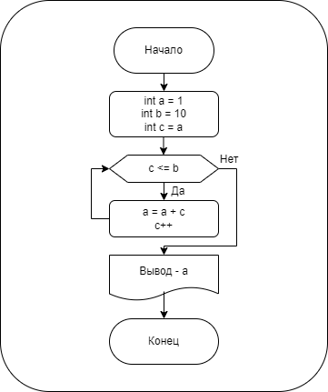

# Домашняя работа № 01
-------------------------------
## Урок 2. Введение и знакомство
- ### 1. Установить среду разработки и написать программу "Привет, мир":

> [Код С++:](lesson_02.cpp)

```
#include <iostream>

int main()
{
    std::cout << "Hello world!" << std::endl;
    
    return 0;
}
```
- ### 2. Установить или ознакомиться с инструментом визуализации алгоритмов и создать визуальное описание алгоритма умножения двух чисел:

> [Блок-схема:](lesson_02.png)


-------------------------------
## Урок 3. Сложность алгоритма и простые алгоритмы
- ### 1. Написать функцию проверки, является ли число простым:

> [Блок-схема:](lesson_03-1.png)


> [Код С++:](lesson_03-1.cpp)
```
#include <iostream>

int main()
{

    int a,b;
    std::cout << "Введите целое число: ";
    std::cin >> a;
    b = a/2;

    while (a%b != 0)
    {
        b--;
    }

    if (b == 1)
    {
        std::cout << "Число " << a << " является простым" << std::endl;
    } else
    {
        std::cout << "Число " << a << " не является простым" << std::endl;
    }
    return 0;
}

```
- ### 2. При помощи инструментов визуализации алгоритмов создать простую блок-схему, описывающую циклический алгоритм сложения чисел от 1 до 10:

> [Блок-схема:](lesson_03-2.png)



-------------------------------
## Урок 4. Рекурсия, рекурсивные алгоритмы
- ### 1. Реализовать функцию перевода чисел из десятичной системы в двоичную, используя рекурсию.

- ### 2. Реализовать функцию возведения числа (a) в степень (b):
> - Рекурсивно.
> - Рекурсивно, используя свойство чётности степени (то есть, если степень, в которую нужно возвести число, чётная, основание возводится в квадрат, а показатель делится на два, а если степень нечётная - результат умножается на основание, а показатель уменьшается на единицу)

- ### 3. Реализовать нахождение количества маршрутов шахматного короля с препятствиями (где единица - это наличие препятствия, а ноль - свободная для хода клетка)(король начинает путь с клетки 0,0)

> [Код С++:](lesson_04.cpp)
```
#include <iostream>

// 01 ////////////////////////////////////

void decToBin(int x)
{
    if(x < 2)
    {
        std::cout << x;
    }
    else
    {
        decToBin(x/2);
        std::cout << x%2;
    }
}

// 02 A /////////////////////////////////

int exponA(int a, int b)
{
    if(b == 0)
    {
        return 1;
    }
    else if(b == 1)
    {
        return a;
    }
    else
    {
        b--;
        a *= exponA(a, b);
    }
}

// 02 B /////////////////////////////////////////

int exponB(int a, int b)
{
    if(b == 0)
    {
        return 1;
    }
    else if(b == 1)
    {
        return a;
    }
    else if(b%2 == 0)
    {
        a *= a;
        b /= 2;
        a = exponB(a, b);
    }
    else
    {
        b--;
        a *= exponB(a, b);
    }

}

//// 03  /////////////////////////////

int ways(int** arr, int x, int y)
{
	if (x == 0 && y == 0)
	{
		return 1;
	}
	else if (x < 0 || y < 0)
	{
		return 0;
	}
	else if (x > 0 && y > 0)
	{
		if (arr[x][y] == 1)
		{
			return 0;
		}
	}
	return ways(arr, x - 1, y) + ways(arr, x, y - 1);
}

int main()
{
//// 01 //////////////////////////////

    int Dec;
    std::cout << "Введите десятичное число: ";
    std::cin >> Dec;
    std::cout << "Ваше число в двоичном виде: ";
    decToBin(Dec);

//// 02  /////////////////////////////

    int num, exp;
    std::cout << "\n\nВведите основание: ";
    std::cin >> num;
    std::cout << "Введите степень: ";
    std::cin >> exp;
    std::cout << "Рекурсивно - " << exponA(num, exp) << std::endl;
    std::cout << "Рекурсивно (св-во четности) - " << exponB(num, exp) << std::endl;

//// 03  /////////////////////////////

	int x = 0;
	int y = 0;

	std::cout << "\n\nКоординаты назначения:\n";
	std::cout << "Введите X: ";
	std::cin >> x;
	std::cout << "Введите Y: ";
	std::cin >> y;

	int** arr = new int*[y+1];
	arr[0] = new int[((x+1)*(y+1))];

	for (size_t i = 0; i <= y; i++)
	{
		arr[i] = arr[0] + (x+1) * i;
	}
	for (size_t i = 0; i <= y; i++)
	{
		for (size_t j = 0; j <= x; j++)
		{
			arr[i][j] = 0;
		}
	}
	arr[1][2] = 1;		// задаем препятствие  [Y][X]

	std::cout << "Количество возможных путей - " << ways(arr, y, x) << std::endl;

	delete[] arr[0];
	delete[] arr;
	arr = nullptr;

    return 0;
}

```