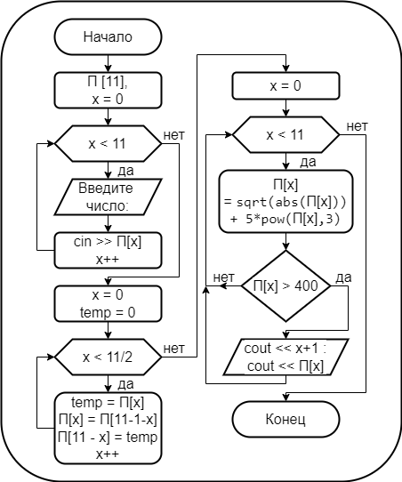

# Домашняя работа № 02
-------------------------------
## Урок 6. Массивы
- ### 1. Реализовать пузырьковую сортировку двумерного массива:

> [Код С++:](lesson_06.cpp)

- ### 2. Описать подробную блок-схему алгоритма Трабба-Прадо-Кнута:

> [Блок-схема:](lesson_06-02.png)

- ### 3. Реализовать алгоритм Трабба-Прадо-Кнута в коде:

> [Код С++:](lesson_06.cpp)
-------------------------------
## Урок 7. Сложные сортировки массивов
- ### 1. Описать в коде улучшенный алгоритм быстрой сортировки:

> [Код С++:](lesson_07.cpp)

- ### 2. Сортировать в массиве целых положительных чисел только чётные числа, нечётные оставив на своих местах при помощи алгоритма блочной сортировки, то есть массив вида [0 2 8 3 4 6 5 9 8 2 7 3] превратить в [0 2 2 3 4 6 5 9 8 8 7 3]:

> [Код С++:](lesson_07.cpp)